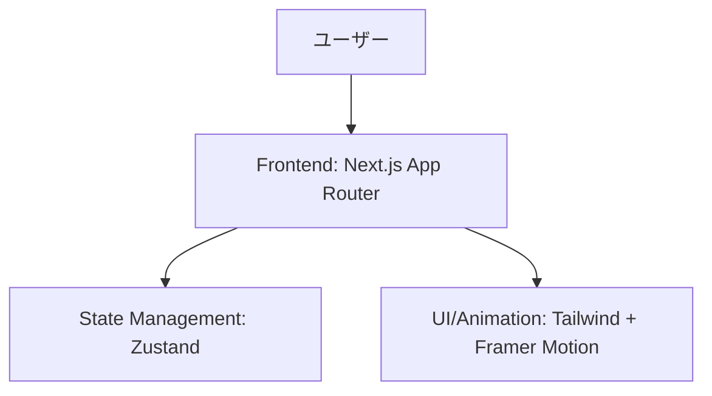
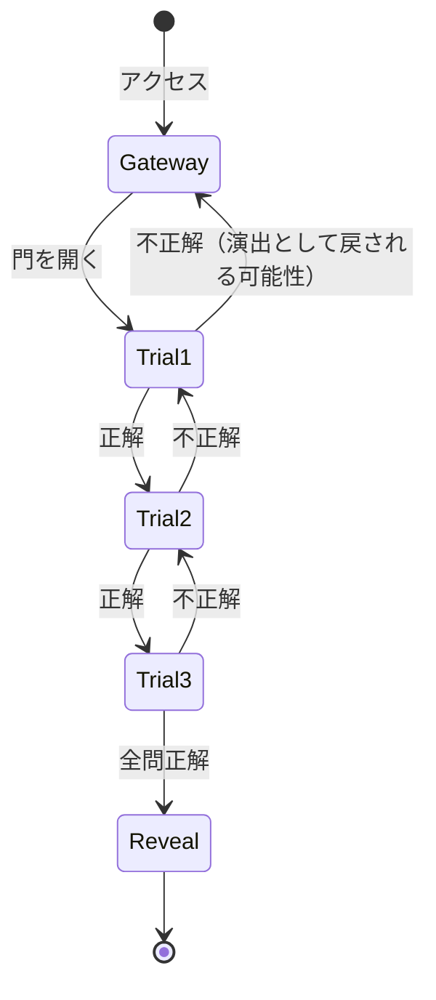

# 機能設計書 (Functional Design Document)

## システム構成図



## 技術スタック

| 分類 | 技術 | 選定理由 |
|------|------|----------|
| フレームワーク | Next.js (App Router) | 高速な開発と優れたSEO/UX、柔軟なルーティングのため。 |
| スタイリング | Tailwind CSS | 迅速かつ高度なカスタマイズが可能なデザインシステム構築のため。 |
| アニメーション | Framer Motion | 「必要以上にリッチなUI」を実現するための強力なアニメーションライブラリ。 |
| 状態管理 | Zustand | クイズの進捗状態をシンプルかつ軽量に管理するため。 |
| 文字効果 | Lucide React | 洗練されたアイコンセットの利用。 |

## データモデル定義

### クイズ状態 (Zustand Store)

```typescript
interface QuizState {
  currentStep: 'gateway' | 'trial1' | 'trial2' | 'trial3' | 'reveal';
  answers: {
    trial1?: string;
    trial2?: string;
    trial3?: string;
  };
  isAuthorized: boolean;
  setStep: (step: QuizState['currentStep']) => void;
  submitAnswer: (trial: 'trial1' | 'trial2' | 'trial3', answer: string) => boolean;
}
```

## コンポーネント設計

### 1. Gateway (秘密結社の門)
**責務**: 没入感の創出と開始の導線。
- 背景アニメーション（パーティクル/煙）の描画。
- 警告文のタイピング演出。
- 覚悟を問う「Enter」ボタン。

### 2. Trial Stages (試練の場)
**責務**: クイズの提示と回答の検証。
- 問題文の謎めいた表示。
- 入力フォームのスタイリッシュな演出。
- 正解/不正解時のドラマチックなフィードバック。

### 3. Reveal (啓示の祭壇)
**責務**: 最終メッセージの表示とアクション。
- 祝福（あるいは合格）の視覚効果。
- Google Meetリンクとメッセージの提示。

## 画面遷移図



## UI/UX設計

### デザイン・テーマ
- **色**: `bg-zinc-950` (漆黒), `text-amber-500` (黄金), `border-zinc-800` (重厚感)
- **フォント**: セリフ体（古文書風）と等幅フォント（ハッカー/システム風）の組み合わせ。
- **エフェクト**: 
    - グロー効果 (Radial Gradient / Drop Shadow)
    - ガラスモルフィズム (Backdrop Blur)
    - スクロール駆動アニメーション

### インタラクション
1. **ホバー演出**: ボタンや入力フィールドにマウスを乗せると、スキャンするような光が走る。
2. **ページ遷移**: ページが切り替わる際、古いページが霧のように消え、新しいページが暗闇から浮かび上がる。
3. **正解演出**: 正解時、画面中央から円状の衝撃波が広がる。

## セキュリティ考慮事項

- **秘密情報の隠蔽**: Google MeetのURLや「正解」の文字列は、ソースコード上に平文で置かず、Base64等の簡易なエンコード、またはハッシュ値との比較を行い、ブラウザの「検証」ツールで即座に露見することを防ぐ。

## テスト戦略

- **正常系テスト**: 全問正解してRevealに到達できるか。
- **レスポンシブテスト**: スマホでもミステリアスな雰囲気が損なわれないか。 (特にアニメーションの負荷)
- **アニメーション安定性**: 複数のアニメーションが重なってもガクつかないか。
