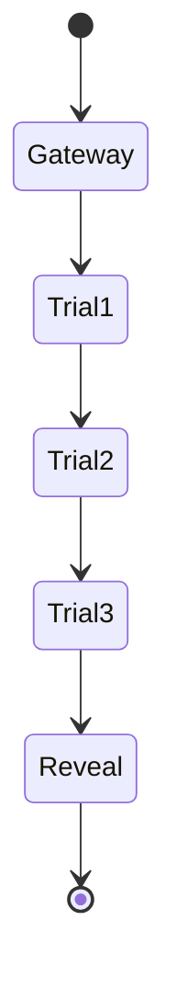

# プロジェクト用語集 (Glossary)

## 概要
このドキュメントは、「The Silent Order」プロジェクト内で使用される用語の定義を管理します。

**更新日**: 2026-04-09

## ドメイン用語

### 秘密結社 (The Order)
**定義**: 本サイトのテーマである架空の組織。
**説明**: ユーザー（招待された友人）が最終的に「入会」または「承認」される対象として描かれる。

### 試練 (Trial)
**定義**: クイズの各ステップ。
**説明**: 全部で3段階あり、これを突破することが最終メッセージ（啓示）への唯一の道とされる。

### 啓示 (Reveal)
**定義**: 本サイトの最終到達画面。
**説明**: Google MeetのURLと招待メッセージが表示される、サプライズの核心部分。

## 技術用語

### Framer Motion
**定義**: React用のアニメーションライブラリ。
**本プロジェクトでの用途**: ミステリアスな空気感、霧のような遷移、魔法のような視覚効果の実装。

### Zustand
**定義**: 軽量な状態管理ライブラリ。
**本プロジェクトでの用途**: クイズの現在のステップ、回答状況のグローバル管理。

### ガラスモルフィズム (Glassmorphism)
**定義**: 反透明な背景とぼかし（Blur）を組み合わせたデザイン手法。
**本プロジェクトでの用途**: 神秘的で高級感のあるUI部品（カード、入力フォーム）のスタイリング。

## ステータス・状態

### ユーザーの進行状態

| 状態 (Step) | 意味 | 遷移条件 |
|------------|------|---------|
| Gateway | 入り口。警告が表示されている状態。 | EnterボタンクリックでTrial1へ |
| Trial1 | 第一の試練。 | 正解でTrial2へ |
| Trial2 | 第二の試練。 | 正解でTrial3へ |
| Trial3 | 第三の試練。 | 正解でRevealへ |
| Reveal | 啓示。サプライズメッセージ表示中。 | N/A |

**状態遷移図**:

## セキュリティ用語

### 難読化 (Obfuscation)
**定義**: プログラムを人間にとって理解しにくくする手法。
**本プロジェクトでの用途**: 正解データや機密リンク（Google Meet）を、デベロッパーツール等で容易に見つけられないようにするための防御策。
